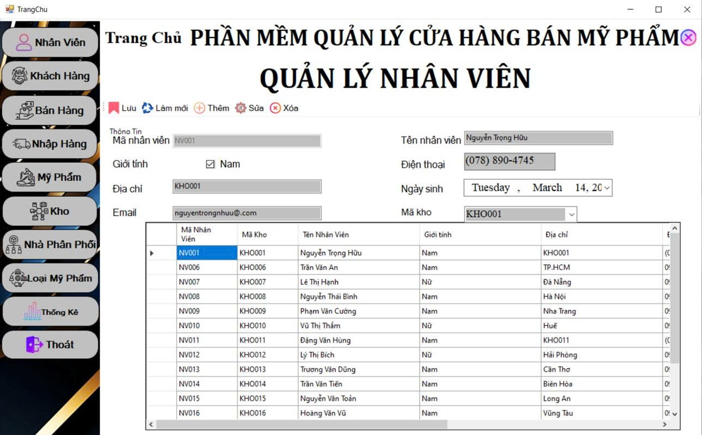

# 💄 Cosmetics-Store - Hệ thống quản lý cửa hàng mỹ phẩm

Dự án xây dựng **ứng dụng WinForms quản lý cửa hàng mỹ phẩm**, phục vụ cho việc bán hàng, quản lý sản phẩm, khách hàng, nhân viên, hóa đơn và báo cáo.

---

## 👨‍💻 Thành viên nhóm
- **Nguyễn Trọng Hữu** - 211591  
- **Nguyễn Thị Hương** - 211631  

---

## 📌 Lý do chọn đề tài
- Ngành mỹ phẩm phát triển mạnh, nhu cầu quản lý bán hàng hiệu quả ngày càng cao.  
- Nhiều cửa hàng hiện quản lý thủ công → dễ thất thoát, khó tra cứu.  
- Phần mềm quản lý giúp **tự động hóa** công việc, tiết kiệm thời gian, giảm sai sót.  

---

## ✨ Tính năng chính
- **Quản lý sản phẩm**: thêm, sửa, xóa, tìm kiếm sản phẩm.  
- **Quản lý khách hàng**: lưu thông tin, hỗ trợ chăm sóc khách hàng.  
- **Quản lý nhân viên**: phân quyền, theo dõi thông tin nhân sự.  
- **Quản lý hóa đơn**: lập hóa đơn bán hàng, tính tiền nhanh chóng.  
- **Báo cáo doanh thu**: thống kê doanh số theo ngày/tháng/năm.  
- **Đăng nhập phân quyền**: đảm bảo an toàn, bảo mật dữ liệu.  

---

## 🛠 Công nghệ sử dụng
- **Ngôn ngữ**: C# (.NET WinForms)  
- **Cơ sở dữ liệu**: SQL Server  
- **Mô hình**: 3-layer (GUI - Business - Data Access)  
- **Công cụ**: Visual Studio 2022, SQL Server Management Studio  

---

## 🚀 Cài đặt & chạy thử
1. Clone repo về máy:
   ```bash
   git clone https://github.com/nguyentronghuu753itpro/Cosmetics-Store.git

Khởi động SQL Server, tạo database và import file backup CosmeticsStore.bak.

Mở project .sln bằng Visual Studio.

Sửa chuỗi kết nối trong file App.config nếu cần:

``` C#
<connectionStrings>
  <add name="CosmeticsStoreDB"
       connectionString="Data Source=.;Initial Catalog=CosmeticsStore;Integrated Security=True" />
</connectionStrings> 
```
Chạy chương trình (F5).

### 📈 Kết quả đạt được

Hệ thống hỗ trợ đầy đủ chức năng quản lý bán hàng mỹ phẩm.
Giao diện thân thiện, dễ sử dụng cho nhân viên.
Quản lý dữ liệu tập trung trên SQL Server, truy vấn nhanh chóng.
Giúp chủ cửa hàng theo dõi doanh thu, hoạt động kinh doanh hiệu quả.

### 🔮 Hướng phát triển

Tích hợp bán hàng online, đồng bộ với website.
Thêm chức năng quản lý tồn kho nâng cao.
Xuất báo cáo ra Excel/PDF.
Hỗ trợ in hóa đơn trực tiếp.
Triển khai trên nền tảng web hoặc mobile.

### Demo giao diện




## Lời cảm ơn

Xin chân thành cảm ơn thầy/cô đã hướng dẫn và hỗ trợ nhóm trong quá trình thực hiện đề tài.

---

📌 README này đã gom toàn bộ ý chính từ báo cáo(giới thiệu, tính năng, công nghệ, cài đặt, kết quả, hướng phát triển). 
